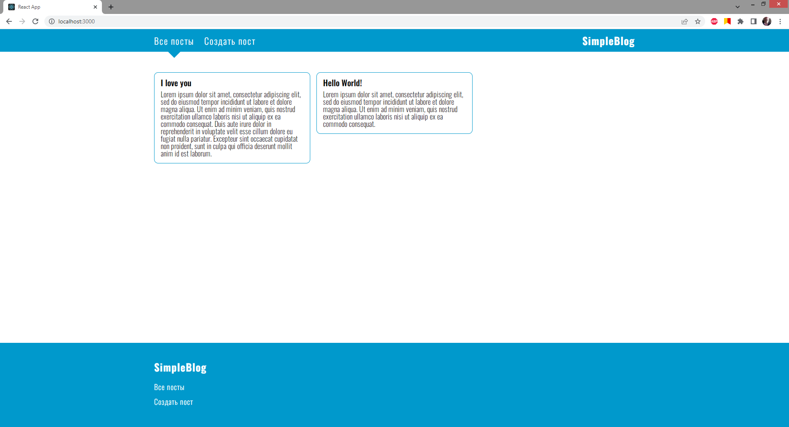
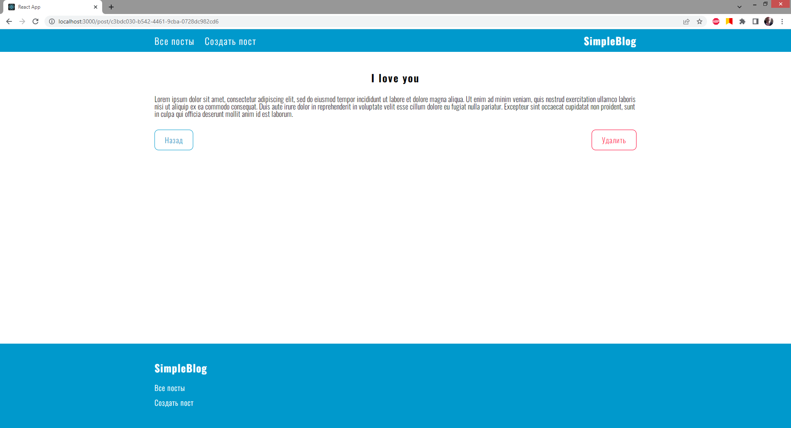
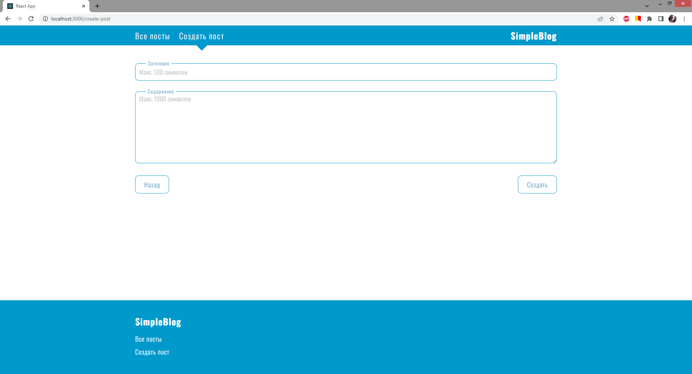

# SimpleBlog

Это тестовый проект написанный на библиотеке [**React**](https://ru.reactjs.org/) с использованием **TypeScript**. В проекте представлена только Frontend составляющая

<br>

### Стек технологий:
+ [**React Hook Form**](https://react-hook-form.com/) - валидация полей
+ [**Redux**](https://redux.js.org/) - стейт менеджер
+ [**React router dom**](https://www.npmjs.com/package/react-router-dom) - навигация

<br>

### Для запуска приложения
```
npm start
```

<br>

___

<br>

## Главная страница


<br>

## Страница поста


<br>

## Страница создания поста
